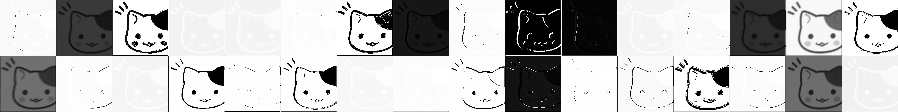
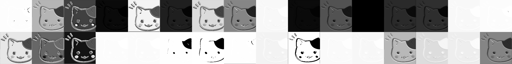

# waifu2x-glsl

waifu2x converter GPU Optimization in OpenGL Shader

## Platform

- Linux
- Mac OS X
- Windows

## How to build

- make

## Usage

```bash
$ ./waifu2x_glsl nyanko.jpg

```

## How to work






## References

- https://github.com/yui0/catseye
- Waifu2x
  - Original implementation: https://github.com/nagadomi/waifu2x
  - https://github.com/ueshita/waifu2x-converter-glsl
  - https://stanko.github.io/super-resolution-image-resizer
- GLSL
  - https://github.com/transcranial/keras-js/tree/master/src/webgl
  - https://github.com/scienceai/neocortex/blob/master/src/lib/webgl/matmul_fragment_shader.glsl
  - https://tenso.rs/demos/fast-neural-style/
- Picture
  - Nyanko: https://www.illust-box.jp/member/view/7263/
  - Nyanko: http://www.poipoi.com/yakko/cgi-bin/sb/log/eid5173.html#more-5173
